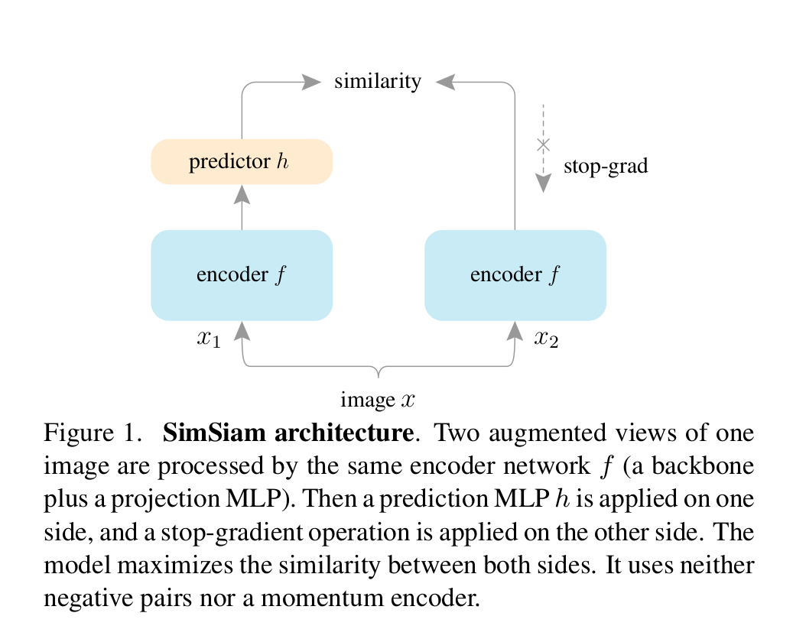
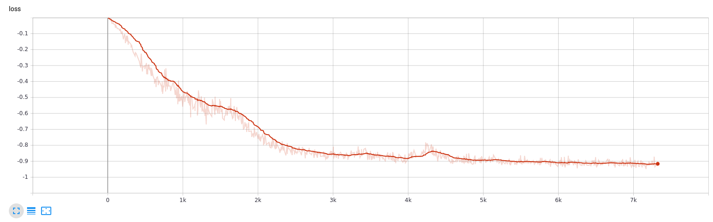

# Implementation of SimSiam

Reference: https://arxiv.org/abs/2011.10566

The main idea behind this paper is that Siamese networks can learn meaningful representations even using none of the following: 
 - (i) negative sample pairs 
 - (ii) large batches 
 - (iii) momentum encoders.

This paper emperically proves that the siamese architecture is a great inductive prior that complements the prior of data augmentation (spatial invarience).


## Architecture
Two augmented views of one image are processed by the same encoder network f (a backbone plus a projection MLP). Then a prediction MLP h is applied on one side, and a stop-gradient operation is applied on the other side. The model maximizes the similarity between both sides.


## Loss
Cosine similarity is used to calculate the loss between the two view obtained from the same image.

```
- F.cosine_similarity(p, z.detach(), dim=-1).mean()
```

## Batch Size
Simsiam doesn't require bigger batch sizes. However, in my experiments, I found that bigger batch sizes had a faster conversion time as compared to the smaller batch sizes. I used 128, 256, and  512 as my batch size. All of them performed around same accuracy but 512 converged faster than 128.

## Optimizer
SGD with `momentum = 0.9` and `weight_decay=0.0005`


## Performance
Here's the loss on CIFAR10



### TODO:
- Design script for training downstream tasks.
